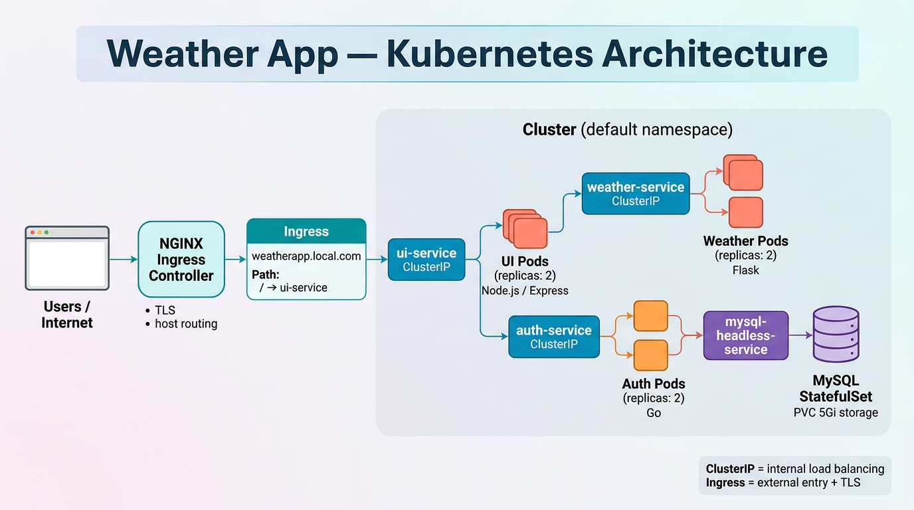
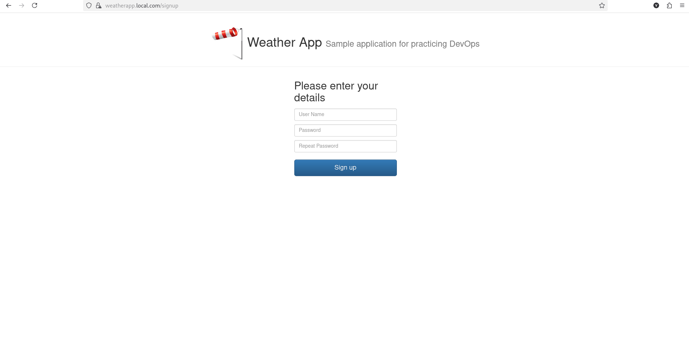
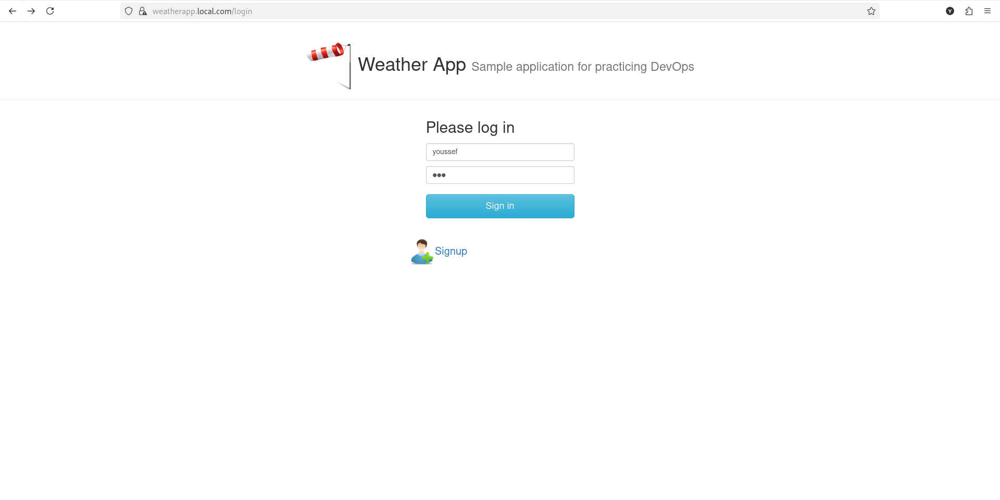
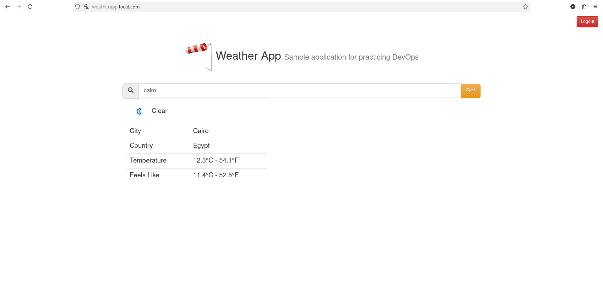

# Weather App on Kubernetes

End-to-end **DevOps exercise**: the same multi-service weather application you would wire with **Docker Compose** is expressed here with **Kubernetes**—declarative manifests, **Ingress + TLS**, **Services** for load balancing, **StatefulSet + PVC** for MySQL, and **Secrets** for credentials. The goal is production-minded packaging: health probes, resource limits, rolling updates, and a clear separation of “edge” vs “app” vs “data.”

---

## Project overview

This repository contains **three application services** and one **datastore**:

1. **`UI`** — Node.js (**Express**) serves HTML/JS and implements **server-side** calls to the other APIs (JWT cookie, login/signup flows, weather proxy). This is the only tier exposed through **Ingress** (path `/`).
2. **`weather`** — **Flask** microservice that fetches live weather from **RapidAPI** (`weatherapi-com`) using an API key injected from a Kubernetes **Secret**.
3. **`authentication`** — **Go (Gin)** microservice for user signup/login, **JWT** issuance, and persistence in **MySQL** (hashed passwords).

**Data:**

4. **MySQL** — Runs as a **StatefulSet** with a **PersistentVolumeClaim** so data survives pod restarts. A **headless Service** gives stable DNS (`mysql-headless-service`) for `DB_HOST`, similar to using a Compose service name. An optional **Job** can run one-off SQL (create DB / grants); the StatefulSet also uses MySQL image env vars for bootstrap.

**Compared to a classic Compose + Nginx setup:**

| In Docker Compose (typical) | In this Kubernetes project |
|----------------------------|----------------------------|
| One **Nginx** container: TLS, HTTP→HTTPS, `proxy_pass /api`, **`upstream`** for many backends | **Ingress** handles TLS + host/path routing to the **UI Service**; **no** Nginx `upstream` in the UI image for that |
| You list **`backend`, `backend2`, `backend3`** in Compose to scale | **One Deployment + one Service**; scale with **`replicas:`**—the Service load-balances across Pods automatically |

Architecture overview:



---

## Folder structure

```text
.
├── UI/
│   ├── app.js                 # Express routes, auth + weather integration
│   ├── Dockerfile             # Node runtime (port 3000)
│   ├── default.conf           # Reference Nginx-style static config (optional / future); not used by current Dockerfile
│   └── public/                # HTML + static assets (login, signup, index)
├── weather/
│   ├── main.py                # Flask: health `/`, weather `/<city>`
│   ├── requirements.txt
│   └── Dockerfile
├── authentication/
│   ├── main/main.go           # Gin: POST /users, POST /users/:id (login), GET /
│   ├── authdb/authdb.go       # MySQL access
│   ├── Dockerfile
│   └── go.mod
├── mysql-init/
│   └── init.sql               # Optional reference SQL
├── k8s/
│   ├── UI/
│   │   ├── ingress.yml        # TLS + host → ui-service
│   │   ├── ui-deployment.yml
│   │   ├── ui-service.yml
│   │   └── tls/               # Local dev cert material (prefer Secret in real use)
│   ├── weather/
│   │   ├── weather-deployment.yml
│   │   └── weather-service.yml
│   └── auth/
│       ├── auth-deployment.yml
│       ├── auth-service.yml
│       └── mysql/
│           ├── mysql-statefulset.yml
│           ├── mysql-headless-service.yml
│           └── init-mysql-job.yml
├── result-images/             # Screenshots + architecture graphic
└── README.md
```

---

## What I built (DevOps scope)

- **Container images** for UI (Node), weather (Flask), and auth (Go), published to a registry and referenced in Deployments (`imagePullPolicy: Always` where configured).
- **Kubernetes workloads:**
  - **Deployments** with **multiple replicas** for UI, weather, and auth (`replicas: 2` where defined) and **RollingUpdate** strategies on weather/auth.
  - **ClusterIP Services** for in-cluster discovery and **kube-proxy** load balancing across Pod endpoints.
  - **Ingress** (`networking.k8s.io/v1`) with **`ingressClassName: nginx`**, TLS secret, and host `weatherapp.local.com` routing `/` → `ui-service:3000`.
  - **StatefulSet + volumeClaimTemplates** for MySQL (5Gi, `storageClassName: standard`—adjust to your cluster).
  - **Headless Service** (`clusterIP: None`) for MySQL.
  - **Job** for optional DB initialization / grants against the headless DNS name.
- **Security & config:** **Secrets** for DB passwords, JWT signing key, RapidAPI key; **no** plaintext secrets in manifests.
- **Operability:** **liveness/readiness** HTTP probes, **requests/limits** on CPU and memory for Pods.

---

## UI (`UI/`)

- **Stack:** Express, `axios` for HTTP to auth and weather Services, `jsonwebtoken` + httpOnly cookie for session.
- **Routes (examples):** `/health` (probes), `/login`, `/signup`, `/` (protected), `/weather/:city` proxies to the weather Service using `WEATHER_HOST` / `WEATHER_PORT`.
- **Environment:** `SECRET_KEY` (must match auth JWT signing), `AUTH_HOST` / `AUTH_PORT`, `WEATHER_HOST` / `WEATHER_PORT`—in the cluster these point at **Kubernetes DNS names** (e.g. `weather-service`, `auth-service.default.svc.cluster.local`).

**Important:** Traffic from the browser hits **only the UI** via Ingress. The UI Pod then calls **auth** and **weather** inside the cluster—there is **no** Ingress path like `/api → Flask` in this design; that role is fulfilled by **Express** + **Services** (contrast with a React-static + Nginx `proxy_pass /api` Compose layout).

---

## Weather service (`weather/`)

- **Flask** app: `GET /` health, `GET /<city>` returns JSON from RapidAPI.
- **Secrets:** `APIKEY` comes from Secret `weather`, key `rapid_api_key` (see `k8s/weather/weather-deployment.yml`).
- **Service:** `weather-service` ClusterIP port **5000** → Pods labeled `app: weather-pod`.

---

## Authentication service (`authentication/`)

- **Go + Gin:** `GET /` health, `POST /users` create user, `POST /users/:id` login and return **JWT**.
- **MySQL** via `DB_HOST`, `DB_PORT`, `DB_USER`, `DB_PASSWORD`, `DB_NAME`; `DB_HOST` is the **headless service** name in-cluster.
- **Service:** `auth-service` ClusterIP port **8080** → `app: auth-pod`.

---

## Data layer (MySQL)

- **StatefulSet** `mysql-statefulset`: one replica, **PVC** for `/var/lib/mysql`.
- **Headless Service** `mysql-headless-service`: used as stable hostname for the MySQL Pod(s).
- **Job** `mysql-init-job` (optional): runs `mysql` client against `mysql-headless-service:3306` to create database/user/grants—same idea as running a one-off client container against a Compose `db` service.

---

## Kubernetes manifests (`k8s/`) — quick reference

| Manifest | Kind | Purpose |
|----------|------|---------|
| `UI/ingress.yml` | Ingress | TLS (`tls-secret`), host `weatherapp.local.com`, path `/` → `ui-service` |
| `UI/ui-deployment.yml` | Deployment | UI replicas, env + probes + resources |
| `UI/ui-service.yml` | Service | ClusterIP `:3000` → UI Pods |
| `weather/weather-deployment.yml` | Deployment | Flask replicas, RollingUpdate, Secret ref for API key |
| `weather/weather-service.yml` | Service | ClusterIP `:5000` |
| `auth/auth-deployment.yml` | Deployment | Go replicas, DB + JWT from `mysql-secret` |
| `auth/auth-service.yml` | Service | ClusterIP `:8080` |
| `auth/mysql/mysql-statefulset.yml` | StatefulSet | MySQL + PVC |
| `auth/mysql/mysql-headless-service.yml` | Service | Headless (`None`) for DNS |
| `auth/mysql/init-mysql-job.yml` | Job | One-shot SQL bootstrap |

Apply order (typical): **Namespace/Secrets** → **StorageClass** (if custom) → **StatefulSet + headless Service** → **Job** (if used) → **Deployments + Services** → **Ingress**.

---

## Docker images

| Path | Runtime | Notes |
|------|---------|------|
| `UI/Dockerfile` | Node | `node app.js`, port **3000** |
| `weather/Dockerfile` | Python / Flask | Exposes **5000** |
| `authentication/Dockerfile` | Go binary | Listens on **8080** via `AUTH_PORT` |

Replace image names in the YAML with your own registry paths after `docker build` and `docker push`.

---

## Prerequisites

- Cluster with **NGINX Ingress Controller** and an IngressClass named **`nginx`** (or change `ingressClassName`).
- **StorageClass** available for MySQL PVC (e.g. `standard`).
- **Secrets** (names/keys must match the manifests), for example:
  - **`mysql-secret`:** `root-password`, `auth-password`, `secret-jwt`
  - **`weather`:** `rapid_api_key` → mounted as env **`APIKEY`** in the weather container
  - **`tls-secret`:** TLS cert for `weatherapp.local.com` (`kubectl create secret tls ...`)
- **`/etc/hosts`** (or DNS) mapping **`weatherapp.local.com`** → Ingress LoadBalancer / Node IP.

---

## Results / screenshots

All assets live under `result-images/`.

| Step | Screenshot |
|------|------------|
| HTTPS / certificate |  |
| Sign up |  |
| Log in |  |
| Weather |  |

---

## Appendix: Docker Compose vs Kubernetes — managing containers vs Pods

This section is the **mental model** behind the project: the same responsibilities, different primitives.

| Topic | Docker Compose | Kubernetes (this repo) |
|-------|----------------|-------------------------|
| **Expose HTTPS to users** | Nginx container: `listen 443`, cert files, `return 301` for HTTP | **Ingress** resource + controller: TLS on the **Ingress**, routing to **Service** |
| **Reverse proxy / route paths** | `location /api { proxy_pass ... }` | Here: **Ingress** → UI only; **server-side** UI calls other **Services**. Alternatively, many teams use **multiple Ingress paths** or a **service mesh**—same idea, different YAML |
| **Load balance across copies** | **`upstream`** with `server backend1; server backend2;` | **Service** `selector` → all **Pods** with that label; kube-proxy balances. Scale with **`replicas`**, not new service names |
| **Service discovery** | Compose **service names** on Docker network | **DNS** (`<service>.<namespace>.svc.cluster.local`) |
| **Stateful database** | Volume + one `postgres`/`mysql` service | **StatefulSet** + **PVC** + headless **Service** for stable identity |
| **Secrets** | `.env`, bind mounts | **`Secret`** + `env.valueFrom.secretKeyRef` |
| **Rolling deploys / health** | Compose restart policies | **Deployment** strategy + **liveness/readiness** probes |
| **One-off admin task** | `docker compose run …` | **Job** or **CronJob** |

**Why a cloud load balancer sometimes appears “in front of” Ingress:** The **Ingress controller** is a **Pod** inside the cluster. Cloud providers often expose it with a **Service `type: LoadBalancer`** so traffic from the Internet reaches the controller. The **Ingress** YAML still defines **rules** (host, path, TLS); the load balancer is **how** packets get to the controller. On a laptop cluster you might use **port-forward**, **NodePort**, or **MetalLB** instead—the layering idea is the same.

**DevOps takeaway:** Defining `backend`, `backend2`, `backend3` in Compose to simulate scale makes it obvious why **orchestrators** exist: Kubernetes turns “**N identical Pods**” into a **single Service** and a **number** you change, while still handling **failures**, **rollouts**, and **storage** in a uniform way.

---

*Personal learning / portfolio project—adjust licensing as needed.*
